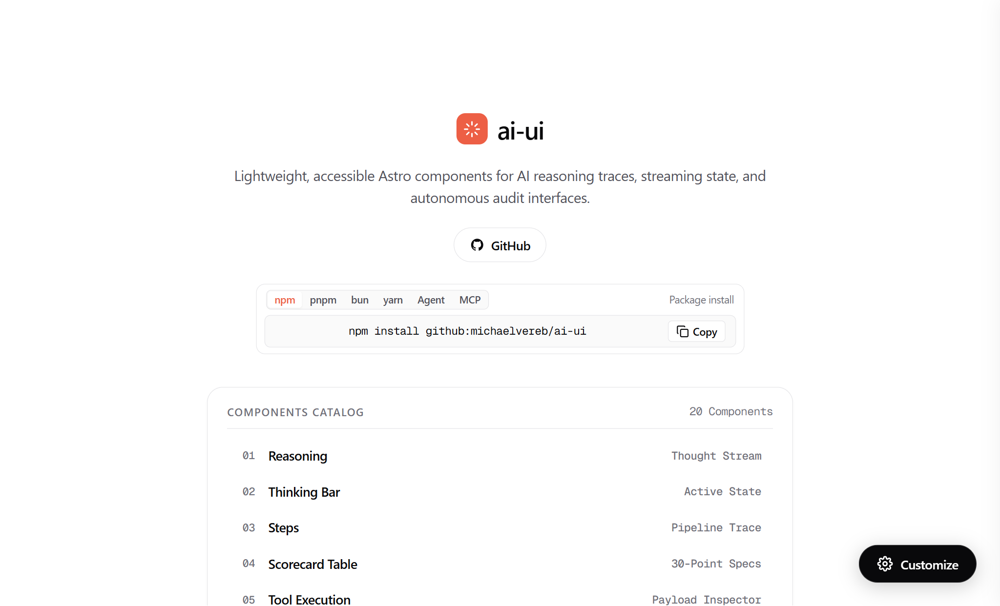

# ai-ui

<p align="center">
  <a href="https://www.michaelvereb.com/ai-ui">
    
  </a>
</p>

<p align="center">
  <a href="https://www.michaelvereb.com/ai-ui"></a>
  <a href="https://astro.build"></a>
  <a href="./LICENSE"></a>
  
  
</p>

> Lightweight, accessible Astro components for AI reasoning traces, streaming state, and autonomous agent interfaces. 100% native Astro, Vanilla JS, and native CSS custom properties. Zero React, zero Radix, zero Tailwind.

**Live Interactive Showcase & Figma-Style Customizer:**  
👉 **[https://www.michaelvereb.com/ai-ui](https://www.michaelvereb.com/ai-ui)**

---

## Installation

Install `@michaelvereb/ai-ui` directly from GitHub using your preferred package manager:

### npm
```bash
npm install github:michaelvereb/ai-ui
```

### pnpm
```bash
pnpm add github:michaelvereb/ai-ui
```

### bun
```bash
bun add github:michaelvereb/ai-ui
```

### yarn
```bash
yarn add github:michaelvereb/ai-ui
```

### 1-Line Agent Install Prompt (Autonomous Coding Agents)
If using Claude Code, Cursor, Antigravity, or OpenAI Operator, provide this single instruction:
```
Fetch and execute the instructions to install @michaelvereb/ai-ui from https://www.michaelvereb.com/ai-ui/prompt.md
```

### Direct Component Copy (Zero-Dependency CLI)
To drop components directly into your Astro repository without adding a package dependency:
```bash
git clone https://github.com/michaelvereb/ai-ui.git ./tmp-ai-ui
mkdir -p ./src/components/ai-ui ./src/components/animations ./src/styles
cp -r ./tmp-ai-ui/src/components/ai-ui/* ./src/components/ai-ui/
cp -r ./tmp-ai-ui/src/components/animations/* ./src/components/animations/
cp ./tmp-ai-ui/src/styles/theme.css ./src/styles/theme.css
rm -rf ./tmp-ai-ui
```

---

## How to Use Components in Your App

Using `@michaelvereb/ai-ui` in your Astro project takes less than two minutes.

### Step 1: Import Base Theme (One-Time Setup)

In your root layout (`src/layouts/Layout.astro`) or global template, import `theme.css`:

```astro
---
// src/layouts/Layout.astro
import '@michaelvereb/ai-ui/theme.css';

interface Props {
  title?: string;
}

const { title = 'My AI App' } = Astro.props;
---

<!DOCTYPE html>
<html lang="en">
  <head>
    <meta charset="UTF-8" />
    <meta name="viewport" content="width=device-width, initial-scale=1.0" />
    <title>{title}</title>
  </head>
  <body>
    <slot />
  </body>
</html>
```

> **Note:** If you used the direct component copy method, import `./src/styles/theme.css` instead.

---

### Step 2: Component Import Options

You can import components in two convenient ways:

#### Option A: Named Imports (Clean & Concise)
```astro
---
import { 
  ThinkingBar, 
  Reasoning, 
  Steps, 
  Tool, 
  PromptInput,
  Suggestions,
  Citation,
  Toaster 
} from '@michaelvereb/ai-ui';
---
```

#### Option B: Direct Subpath Imports (Zero Bundle Overhead)
```astro
---
import Reasoning from '@michaelvereb/ai-ui/Reasoning.astro';
import ThinkingBar from '@michaelvereb/ai-ui/ThinkingBar.astro';
import Steps from '@michaelvereb/ai-ui/Steps.astro';
import Tool from '@michaelvereb/ai-ui/Tool.astro';
---
```

---

### Step 3: Concrete Component Examples

Below are copy-paste examples for the most common AI agent patterns:

#### 1. Collapsible Reasoning Trace (`<Reasoning />`)
Displays real-time or completed model thought streams with expandable steps and duration metrics.

```astro
---
import { Reasoning } from '@michaelvereb/ai-ui';

const thoughtSteps = [
  { text: 'Parsed user prompt and extracted query entities', detail: 'Identified target domain and parameter constraints.' },
  { text: 'Inspecting edge DNS, HTTP/2, and TLS 1.3 handshake', detail: 'HSTS max-age=31536000 verified. Edge TTFB: 124ms.' },
  { text: 'Validating RFC 8259 single-pass JSON-LD structured data', detail: 'Clean UTF-8 and Unicode hex escapes (zero double-escaped entities).' },
  { text: 'Synthesizing 30-point Site-Ready remediation plan', detail: 'Zero-trust headers, schema graph, and crawler discovery aligned.' }
];
---

<Reasoning 
  title="Reasoning Trace" 
  steps={thoughtSteps} 
  defaultOpen={true} 
/>
```

#### 2. Streaming Thinking Indicator (`<ThinkingBar />`)
Shows an active animated pulse, shimmer text, and diagnostic phase rotation while an LLM is generating.

```astro
---
import { ThinkingBar } from '@michaelvereb/ai-ui';

const customPhases = [
  'Auditing edge security headers & TLS 1.3...',
  'Probing autonomous crawler reachability (Claude-User / CCBot)...',
  'Synthesizing diagnostic report...'
];
---

<ThinkingBar 
  phases={customPhases} 
  isStreaming={true} 
  autoCycle={true} 
  cycleIntervalMs={3500} 
/>
```

#### 3. Multi-Step Execution Pipeline (`<Steps />`)
Renders a structured workflow pipeline with status badges (`completed`, `running`, `pending`, `failed`), execution details, and copy-card actions.

```astro
---
import { Steps } from '@michaelvereb/ai-ui';

const pipelineSteps = [
  { id: '1', title: 'Fetch Target DOM', status: 'completed', duration: '142ms', details: 'Direct HTML fetch via edge worker; zero JS execution required.' },
  { id: '2', title: 'Validate Structured Data', status: 'running', duration: '85ms', details: 'Checking RFC 8259 compliance across all application/ld+json blocks.' },
  { id: '3', title: 'Audit Bot Reachability', status: 'pending', details: 'Verify Claude-User and GPTBot user-agents are not challenged.' }
];
---

<Steps 
  title="Agent Diagnostic Pipeline" 
  steps={pipelineSteps} 
  defaultOpen={true} 
/>
```

#### 4. Structured Tool Call Inspector (`<Tool />`)
Inspects MCP or agent tool executions with expandable JSON inputs and outputs.

```astro
---
import { Tool } from '@michaelvereb/ai-ui';
---

<Tool 
  name="cloudflare_dns_lookup" 
  status="completed"
  defaultOpen={false}
  input={{ domain: "www.michaelvereb.com", type: "AAAA" }}
  output={{ address: "100::", proxied: true, ttl: "auto" }} 
/>
```

#### 5. AI Prompt Input Bar (`<PromptInput />`)
A responsive input textarea with model badge, attachment button, keyboard shortcuts (`Enter` to submit, `Shift+Enter` for newline), and submit action.

```astro
---
import { PromptInput } from '@michaelvereb/ai-ui';
---

<PromptInput 
  placeholder="Audit domain (e.g. www.michaelvereb.com) or enter agent prompt..." 
  selectedModel="Claude 3.5 Sonnet"
  submitLabel="Run Audit"
  allowAttachments={true} 
/>
```

#### 6. Clarification Questionnaire (`<Questions />`)
Allows AI agents to ask clarifying questions with interactive selectable cards.

```astro
---
import { Questions } from '@michaelvereb/ai-ui';

const scanOptions = [
  { id: 'opt-1', label: 'Standard Quick Scan', description: 'Checks DNS, SSL, HTTP security headers, and reachability.' },
  { id: 'opt-2', label: 'Full 30-Point Site-Ready Audit', description: 'Deep crawl of schemas, Open Graph, llms.txt, and bot rules.' }
];
---

<Questions 
  question="Select audit depth level:" 
  options={scanOptions} 
  isMultiSelect={false} 
/>
```

#### 7. Interactive Suggestions Chips (`<Suggestions />`)
Quick-prompt recommendation pills that automatically populate the input.

```astro
---
import { Suggestions } from '@michaelvereb/ai-ui';

const sampleSuggestions = [
  'Audit www.michaelvereb.com for AI readiness',
  'Verify RFC 8259 single-pass JSON-LD',
  'Check Claude-User crawler reachability'
];
---

<Suggestions suggestions={sampleSuggestions} />
```

#### 8. Source Citation Badges (`<Citation />`)
Clean, numbered reference badges with live domain favicons and external links.

```astro
---
import { Citation } from '@michaelvereb/ai-ui';
---

<Citation 
  index={1} 
  title="RFC 8259 JSON-LD Single-Pass Parsing Standard" 
  url="https://www.michaelvereb.com/blog/google-json-ld-single-pass" 
/>
```

#### 9. Toast Notification System (`<Toaster />`)
Centered bottom notification pills triggered dynamically from client JavaScript.

```astro
---
import { Toaster } from '@michaelvereb/ai-ui';
---

<!-- Place in your layout or page -->
<Toaster />

<!-- Dispatch from any script, component, or event handler -->
<script>
  window.dispatchEvent(new CustomEvent('ai-toast', {
    detail: { 
      message: 'Audit completed successfully!', 
      type: 'success' 
    }
  }));
</script>
```

#### 10. Kinetic Text Animations (`<AnimateText />` & `<TextShimmer />`)
GPU-accelerated text reveals (20 effects via WAAPI) and continuous gradient shimmers.

```astro
---
import { AnimateText, TextShimmer } from '@michaelvereb/ai-ui';
---

<!-- Continuous shimmer sweep -->
<TextShimmer text="Synthesizing 30-point remediation report..." />

<!-- High-agency WAAPI kinetic entrance -->
<AnimateText effect="soft-blur-in" text="Audit verified with 100% pass rate." />
```

---

## Keeping Components Always Updated

Because `@michaelvereb/ai-ui` uses the **direct GitHub resolver pattern**, you never have to wait for npmjs registry release cycles:

### Updating an External Project
To sync to the latest commits on `main` at any time, run:

```bash
npm update @michaelvereb/ai-ui
# or
pnpm update @michaelvereb/ai-ui
# or
bun update @michaelvereb/ai-ui
```

If your package manager locks the commit hash, you can force-pull the latest `main` branch:
```bash
pnpm add github:michaelvereb/ai-ui#main
```

### Monorepo / Local Workspace Setup
If you are developing inside the Vereb monorepo or want real-time local file linkage, point `package.json` to the local path:

```json
"dependencies": {
  "@michaelvereb/ai-ui": "file:../../packages/ai-ui"
}
```

Edits reflect **instantly via Vite HMR with 0ms build or publish delay**.

---

## Components Catalog

Every component is modular, accessible, and self-contained with no external CSS framework requirements.

| Component | Live Preview | Description | Quick Snippet |
|---|---|---|---|
| **[Reasoning](https://www.michaelvereb.com/ai-ui/component/reasoning)** | [Live Demo](https://www.michaelvereb.com/ai-ui/component/reasoning) | Collapsible thought stream with sequential checkmark progression down each step | `<Reasoning defaultOpen={true} />` |
| **[ThinkingBar](https://www.michaelvereb.com/ai-ui/component/thinking-bar)** | [Live Demo](https://www.michaelvereb.com/ai-ui/component/thinking-bar) | Floating thinking indicator with text shimmer and diagnostic phase rotation | `<ThinkingBar autoCycle={true} isStreaming={true} />` |
| **[Steps](https://www.michaelvereb.com/ai-ui/component/steps)** | [Live Demo](https://www.michaelvereb.com/ai-ui/component/steps) | Multi-step execution pipeline with copy button on cards and technical drawer | `<Steps steps={pipelineSteps} title="Pipeline" />` |
| **[Tool](https://www.michaelvereb.com/ai-ui/component/tool)** | [Live Demo](https://www.michaelvereb.com/ai-ui/component/tool) | Structured tool call card with JSON input & output inspector | `<Tool name="probe_api" input={in} output={out} />` |
| **[ChainOfThought](https://www.michaelvereb.com/ai-ui/component/chain-of-thought)** | [Live Demo](https://www.michaelvereb.com/ai-ui/component/chain-of-thought) | Visual reasoning nodes connected by continuous flow lines | `<ChainOfThought nodes={thoughtNodes} />` |
| **[PromptInput](https://www.michaelvereb.com/ai-ui/component/prompt-input)** | [Live Demo](https://www.michaelvereb.com/ai-ui/component/prompt-input) | AI prompt bar with model tag, attachment trigger, and submit action | `<PromptInput placeholder="Enter prompt..." />` |
| **[ModelSelector](https://www.michaelvereb.com/ai-ui/component/model-selector)** | [Live Demo](https://www.michaelvereb.com/ai-ui/component/model-selector) | Dropdown for choosing orchestrator models and provider tiers | `<ModelSelector selectedId="claude-3-5-sonnet" />` |
| **[Suggestions](https://www.michaelvereb.com/ai-ui/component/suggestions)** | [Live Demo](https://www.michaelvereb.com/ai-ui/component/suggestions) | Interactive recommendation chips for standard queries and verification runs | `<Suggestions suggestions={list} />` |
| **[Questions](https://www.michaelvereb.com/ai-ui/component/questions)** | [Live Demo](https://www.michaelvereb.com/ai-ui/component/questions) | Interactive clarification questionnaire card with radio / selectable options | `<Questions question="Select depth:" options={opts} />` |
| **[FeedbackBar](https://www.michaelvereb.com/ai-ui/component/feedback-bar)** | [Live Demo](https://www.michaelvereb.com/ai-ui/component/feedback-bar) | Inline rating bar with thumbs up/down, copy to clipboard, and report triggers | `<FeedbackBar />` |
| **[Attachments](https://www.michaelvereb.com/ai-ui/component/attachments)** | [Live Demo](https://www.michaelvereb.com/ai-ui/component/attachments) | File chips with file type indicators, byte size badges, and delete actions | `<Attachments files={files} />` |
| **[Citation](https://www.michaelvereb.com/ai-ui/component/citation)** | [Live Demo](https://www.michaelvereb.com/ai-ui/component/citation) | Numbered reference badge with live domain favicons and external link icons | `<Citation index={1} title="RFC 8259" url="..." />` |
| **[Message](https://www.michaelvereb.com/ai-ui/component/message)** | [Live Demo](https://www.michaelvereb.com/ai-ui/component/message) | Message container with author metadata, avatars, timestamps, and copy action | `<Message role="assistant">Diagnostic passed.</Message>` |
| **[Thread](https://www.michaelvereb.com/ai-ui/component/thread)** | [Live Demo](https://www.michaelvereb.com/ai-ui/component/thread) | Conversation container grouping related user and assistant message streams | `<Thread title="Audit Run">...</Thread>` |
| **[Loader](https://www.michaelvereb.com/ai-ui/component/loader)** | [Live Demo](https://www.michaelvereb.com/ai-ui/component/loader) | Agent execution states (spinner, dots, pulse, progress bar) styled as pills | `<Loader variant="spinner" size="md" />` |
| **[TextShimmer](https://www.michaelvereb.com/ai-ui/component/text-shimmer)** | [Live Demo](https://www.michaelvereb.com/ai-ui/component/text-shimmer) | Smooth, animated gradient sweep signaling active LLM reasoning | `<TextShimmer text="Synthesizing report..." />` |
| **[Image](https://www.michaelvereb.com/ai-ui/component/image)** | [Live Demo](https://www.michaelvereb.com/ai-ui/component/image) | Framed visual container with aspect ratios, hairline border, and captions | `<Image src="..." alt="..." caption="..." />` |
| **[Toaster](https://www.michaelvereb.com/ai-ui/component/toaster)** | [Live Demo](https://www.michaelvereb.com/ai-ui/component/toaster) | Centered notification pills emerging from the bottom with auto-dismiss | `<Toaster />` |
| **[ThemeCustomizer](https://www.michaelvereb.com/ai-ui)** | [Live Demo](https://www.michaelvereb.com/ai-ui) | Figma-style docked side panel for base color, mode, typography & radius | `<ThemeCustomizer />` |
| **[AnimateText](https://www.michaelvereb.com/ai-ui/component/text-animations)** | [Live Demo](https://www.michaelvereb.com/ai-ui/component/text-animations) | 20 text streaming & reveal animations via native WAAPI | `<AnimateText effect="soft-blur-in" text="..." />` |

---

## Styling & Theme Tokens

All styling is configured using CSS custom properties. You can easily override them in your project's stylesheet or `:root`:

```css
:root {
  /* Brand Accent / Base Color */
  --primary: #ED5F45;
  --heat: var(--primary);
  
  /* Canvas & Surfaces */
  --bg: #ffffff;
  --surface: #ffffff;
  --border: #e4e4e7;
  --border-width: 1px;
  
  /* Radii */
  --radius: 14px;
  --radius-card: var(--radius);
  --radius-pill: 9999px;
  
  /* Typography */
  --font-heading: -apple-system, BlinkMacSystemFont, 'SF Pro', 'SF Pro Display', sans-serif;
  --font-sans: -apple-system, BlinkMacSystemFont, 'SF Pro', 'SF Pro Text', sans-serif;
  --tracking-ui: -0.02em;
}

/* Dark Mode is activated via .dark class or data-theme="dark" on <html> */
html.dark, html[data-theme="dark"] {
  --bg: #09090b;
  --surface: #131316;
  --border: #27272a;
}
```

Use the live **[ThemeCustomizer](https://www.michaelvereb.com/ai-ui)** on the demo site to visually tweak base colors, light/dark mode, border radii, and export customized CSS directly into your clipboard.

---

## Universal MCP (Model Context Protocol) Support

`ai-ui` includes a universal Model Context Protocol endpoint to let any AI agent (Claude, Cursor, Antigravity, ChatGPT Operator, etc.) inspect, fetch, and configure components programmatically:

### Universal Endpoint
```
https://www.michaelvereb.com/mcp
```

### Claude CLI
```bash
claude mcp add ai-ui -- https://www.michaelvereb.com/mcp
```

### Config JSON (Claude Desktop, Cursor, Antigravity)
```json
{
  "mcpServers": {
    "ai-ui": {
      "url": "https://www.michaelvereb.com/mcp"
    }
  }
}
```

---

## Tech Stack & Architecture

| Layer | Technology | Details |
|---|---|---|
| **Framework** | **Astro 5+** | Pure `.astro` components. 0ms client-side JavaScript execution unless interactive. |
| **Logic** | **Vanilla JS** | Micro-controllers scoped with `data-` attributes. Zero React, Vue, or Angular dependencies. |
| **Styling** | **Native CSS Custom Properties** | Structured tokens (`--heat`, `--primary`, `--surface`, `--border`, `--radius`). Strictly zero Tailwind. |
| **Motion** | **Web Animations API (WAAPI)** | GPU-accelerated text reveals and shimmer sweeps with CSS keyframe fallbacks. |
| **Icons** | **Lucide-Compatible SVG** | Clean vector line icons. Strictly zero emojis in code or UI. |
| **Theming** | **Figma-Style Live Drawer** | Real-time dynamic theme switching, base color palette mapping, and OKLCH/Hex CSS code export. |

---

## AI Agent Integration

`ai-ui` is built from the ground up to be machine-actionable:

- **1-Line Setup Prompt:** [https://www.michaelvereb.com/ai-ui/prompt.md](https://www.michaelvereb.com/ai-ui/prompt.md)
- **Machine-Readable LLM Index:** [https://www.michaelvereb.com/ai-ui/llms.txt](https://www.michaelvereb.com/ai-ui/llms.txt)
- **Agent Skill Manifest:** `.agents/skills/ai-ui/SKILL.md`
- **Developer Guidelines:** [AGENTS.md](./AGENTS.md)

---

## License

MIT License © 2026 [Michael Vereb](https://www.michaelvereb.com).
