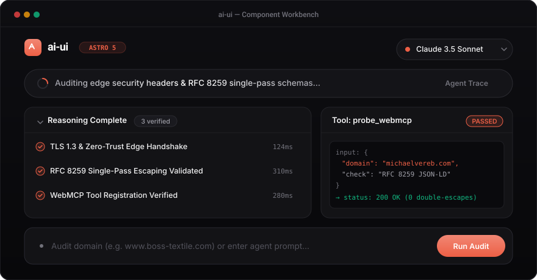

# ai-ui

<p align="center">
  <a href="https://www.michaelvereb.com/ai-ui">
    
  </a>
</p>

<p align="center">
  <a href="https://www.michaelvereb.com/ai-ui"></a>
  <a href="https://astro.build"></a>
  <a href="./LICENSE"></a>
  
  
</p>

> Lightweight, accessible Astro components for AI reasoning traces, streaming state, and autonomous agent interfaces. 100% native Astro, Vanilla JS, and native CSS custom properties. Zero React, zero Radix, zero Tailwind.

**Live Interactive Showcase & Figma-Style Customizer:**  
👉 **[https://www.michaelvereb.com/ai-ui](https://www.michaelvereb.com/ai-ui)**

---

## Installation

Install `@michaelvereb/ai-ui` directly from GitHub using your preferred package manager:

### npm
```bash
npm install github:michaelvereb/ai-ui
```

### pnpm
```bash
pnpm add github:michaelvereb/ai-ui
```

### bun
```bash
bun add github:michaelvereb/ai-ui
```

### yarn
```bash
yarn add github:michaelvereb/ai-ui
```

### 1-Line Agent Install Prompt (Autonomous Coding Agents)
If using Claude Code, Cursor, Antigravity, or OpenAI Operator, provide this single instruction:
```
Fetch and execute the instructions to install @michaelvereb/ai-ui from https://www.michaelvereb.com/ai-ui/prompt.md
```

### Direct Component Copy (Zero-Dependency CLI)
To drop components directly into your Astro repository without adding an npm dependency:
```bash
git clone https://github.com/michaelvereb/ai-ui.git ./tmp-ai-ui
mkdir -p ./src/components/ai-ui ./src/components/animations ./src/styles
cp -r ./tmp-ai-ui/src/components/ai-ui/* ./src/components/ai-ui/
cp -r ./tmp-ai-ui/src/components/animations/* ./src/components/animations/
cp ./tmp-ai-ui/src/styles/theme.css ./src/styles/theme.css
rm -rf ./tmp-ai-ui
```

---

## Tech Stack & Architecture

| Layer | Technology | Details |
|---|---|---|
| **Framework** | **Astro 5+** | Pure `.astro` components. 0ms client-side JavaScript execution unless interactive. |
| **Logic** | **Vanilla JS** | Micro-controllers scoped with `data-` attributes. Zero React, Vue, or Angular dependencies. |
| **Styling** | **Native CSS Custom Properties** | Structured tokens (`--heat`, `--primary`, `--surface`, `--border`, `--radius`). Strictly zero Tailwind. |
| **Motion** | **Web Animations API (WAAPI)** | GPU-accelerated text reveals and shimmer sweeps with CSS keyframe fallbacks. |
| **Icons** | **Lucide-Compatible SVG** | Clean vector line icons. Strictly zero emojis in code or UI. |
| **Theming** | **Figma-Style Live Drawer** | Real-time dynamic theme switching, base color palette mapping, and OKLCH/Hex CSS code export. |

---

## Requirements & Prerequisites

- **Runtime:** Node.js 18.0+, Bun 1.0+, or Deno 1.38+
- **Project:** Existing [Astro](https://astro.build) project (`astro >= 4.0.0` or `astro >= 5.0.0`)
- **Setup:** Import `@michaelvereb/ai-ui/theme.css` in your root layout or global stylesheet.

---

## Quick Start Guide

### 1. Import Base Theme
Import the core design tokens in your root layout (`src/layouts/Layout.astro` or page):

```astro
---
import '@michaelvereb/ai-ui/theme.css';
---

<!DOCTYPE html>
<html lang="en">
  <head>
    <meta charset="UTF-8" />
  </head>
  <body>
    <slot />
  </body>
</html>
```

### 2. Use Components
Import any component from `@michaelvereb/ai-ui/components/*`:

```astro
---
import ThinkingBar from '@michaelvereb/ai-ui/components/ThinkingBar.astro';
import Reasoning from '@michaelvereb/ai-ui/components/Reasoning.astro';
import Steps from '@michaelvereb/ai-ui/components/Steps.astro';
import PromptInput from '@michaelvereb/ai-ui/components/PromptInput.astro';
import Toaster from '@michaelvereb/ai-ui/components/Toaster.astro';
---

<!-- Active LLM Thinking Indicator -->
<ThinkingBar autoCycle={true} isStreaming={true} />

<!-- Collapsible Reasoning Trace -->
<Reasoning defaultOpen={true} />

<!-- Sequential Pipeline -->
<Steps title="Agent Diagnostic Pipeline" />

<!-- Floating Toaster Container -->
<Toaster />
```

---

## Components

Every component is modular, accessible, and self-contained with no external CSS framework requirements.

| Component | Live Preview | Description | Quick Snippet |
|---|---|---|---|
| **[Reasoning](https://www.michaelvereb.com/ai-ui#comp-reasoning)** | [Live Demo](https://www.michaelvereb.com/ai-ui#comp-reasoning) | Collapsible thought stream with sequential checkmark progression down each step | `<Reasoning defaultOpen={true} />` |
| **[ThinkingBar](https://www.michaelvereb.com/ai-ui#comp-thinking-bar)** | [Live Demo](https://www.michaelvereb.com/ai-ui#comp-thinking-bar) | Floating thinking indicator with text shimmer and diagnostic phase rotation | `<ThinkingBar autoCycle={true} isStreaming={true} />` |
| **[Steps](https://www.michaelvereb.com/ai-ui#comp-steps)** | [Live Demo](https://www.michaelvereb.com/ai-ui#comp-steps) | Multi-step execution pipeline with copy button on cards and technical drawer | `<Steps steps={stepsData} title="Pipeline" />` |
| **[Tool](https://www.michaelvereb.com/ai-ui#comp-tool)** | [Live Demo](https://www.michaelvereb.com/ai-ui#comp-tool) | Structured tool call card with JSON input & output inspector | `<Tool name="probe_api" input={in} output={out} />` |
| **[ChainOfThought](https://www.michaelvereb.com/ai-ui#comp-chain-of-thought)** | [Live Demo](https://www.michaelvereb.com/ai-ui#comp-chain-of-thought) | Visual reasoning nodes connected by continuous flow lines | `<ChainOfThought nodes={thoughtNodes} />` |
| **[PromptInput](https://www.michaelvereb.com/ai-ui#comp-prompt-input)** | [Live Demo](https://www.michaelvereb.com/ai-ui#comp-prompt-input) | AI prompt bar with model tag, attachment trigger, and submit action | `<PromptInput placeholder="Enter prompt..." />` |
| **[ModelSelector](https://www.michaelvereb.com/ai-ui#comp-model-selector)** | [Live Demo](https://www.michaelvereb.com/ai-ui#comp-model-selector) | Dropdown for choosing orchestrator models and provider tiers | `<ModelSelector selectedId="claude-3-5-sonnet" />` |
| **[Suggestions](https://www.michaelvereb.com/ai-ui#comp-suggestions)** | [Live Demo](https://www.michaelvereb.com/ai-ui#comp-suggestions) | Interactive recommendation chips for standard queries and verification runs | `<Suggestions suggestions={list} />` |
| **[Questions](https://www.michaelvereb.com/ai-ui#comp-questions)** | [Live Demo](https://www.michaelvereb.com/ai-ui#comp-questions) | Interactive clarification questionnaire card with radio / selectable options | `<Questions question="Select depth:" options={opts} />` |
| **[FeedbackBar](https://www.michaelvereb.com/ai-ui#comp-feedback-bar)** | [Live Demo](https://www.michaelvereb.com/ai-ui#comp-feedback-bar) | Inline rating bar with thumbs up/down, copy to clipboard, and report triggers | `<FeedbackBar />` |
| **[Attachments](https://www.michaelvereb.com/ai-ui#comp-attachments)** | [Live Demo](https://www.michaelvereb.com/ai-ui#comp-attachments) | File chips with file type indicators, byte size badges, and delete actions | `<Attachments files={files} />` |
| **[Citation](https://www.michaelvereb.com/ai-ui#comp-citation)** | [Live Demo](https://www.michaelvereb.com/ai-ui#comp-citation) | Numbered reference badge with live domain favicons and external link icons | `<Citation index={1} title="RFC 8259" url="..." />` |
| **[Message](https://www.michaelvereb.com/ai-ui#comp-message)** | [Live Demo](https://www.michaelvereb.com/ai-ui#comp-message) | Message container with author metadata, avatars, timestamps, and copy action | `<Message role="assistant">Diagnostic passed.</Message>` |
| **[Thread](https://www.michaelvereb.com/ai-ui#comp-thread)** | [Live Demo](https://www.michaelvereb.com/ai-ui#comp-thread) | Conversation container grouping related user and assistant message streams | `<Thread title="Audit Run">...</Thread>` |
| **[Loader](https://www.michaelvereb.com/ai-ui#comp-loader)** | [Live Demo](https://www.michaelvereb.com/ai-ui#comp-loader) | Agent execution states (spinner, dots, pulse, progress bar) styled as pills | `<Loader variant="spinner" size="md" />` |
| **[TextShimmer](https://www.michaelvereb.com/ai-ui#comp-text-shimmer)** | [Live Demo](https://www.michaelvereb.com/ai-ui#comp-text-shimmer) | Smooth, animated gradient sweep signaling active LLM reasoning | `<TextShimmer text="Synthesizing report..." />` |
| **[Image](https://www.michaelvereb.com/ai-ui#comp-image)** | [Live Demo](https://www.michaelvereb.com/ai-ui#comp-image) | Framed visual container with aspect ratios, hairline border, and captions | `<Image src="..." alt="..." caption="..." />` |
| **[Toaster](https://www.michaelvereb.com/ai-ui#comp-toaster)** | [Live Demo](https://www.michaelvereb.com/ai-ui#comp-toaster) | Centered notification pills emerging from the bottom with auto-dismiss | `<Toaster />` |
| **[ThemeCustomizer](https://www.michaelvereb.com/ai-ui)** | [Live Demo](https://www.michaelvereb.com/ai-ui) | Figma-style docked side panel for base color, mode, typography & radius | `<ThemeCustomizer />` |
| **[AnimateText](https://www.michaelvereb.com/ai-ui#comp-text-animations)** | [Live Demo](https://www.michaelvereb.com/ai-ui#comp-text-animations) | 20 text streaming & reveal animations via native WAAPI | `<AnimateText effect="soft-blur-in" text="..." />` |

---

## Styling & Theme Tokens

All styling is configured using CSS custom properties. Override them in `:root` or via the live **ThemeCustomizer**:

```css
:root {
  /* Brand Accent / Base Color */
  --primary: #ED5F45;
  --heat: var(--primary);
  
  /* Canvas & Surfaces */
  --bg: #ffffff;
  --surface: #ffffff;
  --border: #e4e4e7;
  --border-width: 1px;
  
  /* Radii */
  --radius: 14px;
  --radius-card: var(--radius);
  --radius-pill: 9999px;
  
  /* Typography */
  --font-heading: -apple-system, BlinkMacSystemFont, 'SF Pro', 'SF Pro Display', sans-serif;
  --font-sans: -apple-system, BlinkMacSystemFont, 'SF Pro', 'SF Pro Text', sans-serif;
  --tracking-ui: -0.02em;
}

/* Dark Mode is activated via .dark class or data-theme="dark" on <html> */
html.dark, html[data-theme="dark"] {
  --bg: #09090b;
  --surface: #131316;
  --border: #27272a;
}
```

---

## AI Agent Integration

`ai-ui` is built from the ground up to be machine-actionable:

- **1-Line Setup Prompt:** [https://www.michaelvereb.com/ai-ui/prompt.md](https://www.michaelvereb.com/ai-ui/prompt.md)
- **Machine-Readable LLM Index:** [https://www.michaelvereb.com/ai-ui/llms.txt](https://www.michaelvereb.com/ai-ui/llms.txt)
- **Agent Skill Manifest:** `.agents/skills/ai-ui/SKILL.md`
- **Developer Guidelines:** [AGENTS.md](./AGENTS.md)

---

## License

MIT License © 2026 [Michael Vereb](https://www.michaelvereb.com).
